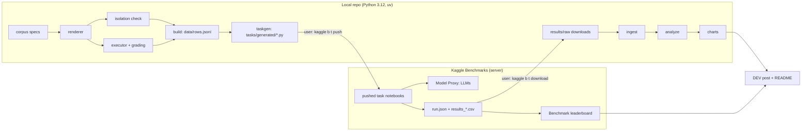
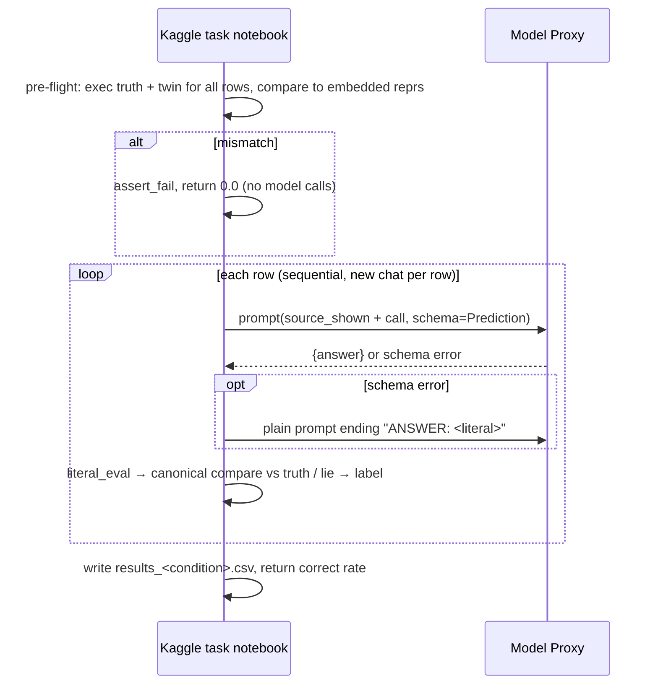

# HANDOFF.md — Lying Context: Which stale signal fools AI most?

> **Planning status:** 🔒 LOCKED  ·  **Planned:** 2026-09-30  ·  **Autonomy:** A1 (files only)
>
> This document contains the implementation contract. Execution may refine low-level details but may not change product scope, architecture boundaries, or acceptance criteria without following the [change policy](#25-execution-change-policy).

---

## At a Glance

| | |
|---|---|
| **Project** | Lying Context (`lying-context-bench`) |
| **Thesis** | When code carries one stale signal (docstring, type hint, identifier name, or comment), we measure which kind most often pulls models to the lie's exact answer, giving developers a cleanup priority before handing code to AI. |
| **Hook** | The same function shown twice with one changed line. The model's answer flips from correct to the lie's exact answer. Below it, a ranked chart of fooled rate by lie type. |
| **Deadline** | 2026-10-11 23:59 PDT (post goes live Oct 10, Oct 11 is buffer) |
| **Feature freeze** | End of session S8 (Oct 8), about 13.8 of 17 build hours (81%) |
| **Stack** | Python 3.12 via `uv` · `kaggle-benchmarks` 0.6.1 · `kaggle` CLI 2.2.4 · stdlib `ast`/`tokenize` · pandas · matplotlib · pytest · ruff · GitHub Actions · JSONL/CSV in git |
| **Plan size** | 6 phases · 33 execution steps |
| **Largest risk** | The effect may be small or zero for strong models. Retired in P2.3–P2.4. Fallback: denser functions paid for with extension quota, and an honestly reported resistance ranking. |

---

## Table of Contents

1. [Document Control](#1-document-control)
2. [Source of Truth](#2-source-of-truth)
3. [Product Contract](#3-product-contract)
4. [Success and Acceptance Criteria](#4-success-and-acceptance-criteria)
5. [Scope Lock](#5-scope-lock)
6. [User Journey and Functional Requirements](#6-user-journey-and-functional-requirements)
7. [UX and Visual Specification](#7-ux-and-visual-specification)
8. [System Architecture](#8-system-architecture)
9. [Stack and Toolchain Lock](#9-stack-and-toolchain-lock)
10. [Proposed Repository Structure](#10-proposed-repository-structure)
11. [API and Event Contracts](#11-api-and-event-contracts)
12. [Data Model and State](#12-data-model-and-state)
13. [External Integrations](#13-external-integrations)
14. [Security, Privacy, and Abuse Controls](#14-security-privacy-and-abuse-controls)
15. [Reliability and Failure Design](#15-reliability-and-failure-design)
16. [Test and Verification Strategy](#16-test-and-verification-strategy)
17. [Deployment and Operations](#17-deployment-and-operations)
18. [Demo and Submission Plan](#18-demo-and-submission-plan)
19. [Clock and Budget](#19-clock-and-budget)
20. [Risk Register and Pre-Mortem](#20-risk-register-and-pre-mortem)
21. [Decision Log](#21-decision-log)
22. [Assumptions and Phase 0 Verification](#22-assumptions-and-phase-0-verification)
23. [Phase Plan](#23-phase-plan)
24. [Numbered Execution Queue](#24-numbered-execution-queue)
25. [Execution Change Policy](#25-execution-change-policy)
26. [Quality Gates](#26-quality-gates)
27. [Execution State](#27-execution-state)
28. [Prompt 2 Resume Block](#28-prompt-2-resume-block)
29. [How to Continue](#29-how-to-continue)

---
---

## 1. Document Control

| Field | Value |
|---|---|
| Planning status | **LOCKED** |
| Planning date | 2026-09-30 |
| Source Prompt 0 packet | `kaggle-benchmarks/Docs/prompt0.md` ("PROMPT 0 → PROMPT 1 IDEA PACKET: Lying Context") |
| Hackathon | Kaggle Benchmarking Challenge (DEV × Kaggle) |
| Deadline | **2026-10-11 23:59 PDT** · target publish 2026-10-10 evening |
| Realistic build hours | 17 usable (10 sessions S1–S10, one per day Oct 1–10, each ≤ 2 h) |
| Feature freeze | End of S8 (Oct 8), about 13.8 build hours (81%) |
| Execution autonomy | **A1**: the agent edits files only. The user runs every command, git operation and Kaggle action. |
| Repository state | Exists. Contains `.git`, `LICENSE` (MIT), `README.md`, `Docs/`. |
| Local path | `/home/kernel-kain/Documents/Github/lying-context-bench` |
| Remote URL | https://github.com/kernelKain/lying-context-bench (public) |
| Live URL | NOT YET DEPLOYED. Public artifacts will be the Kaggle benchmark, the DEV post and the GitHub repo. |

> **Path note:** this repo uses `Docs/` (capital D). Every `docs/` path in this document means `Docs/`.

[↑ Back to top](#table-of-contents)

---
---

## 2. Source of Truth

### Authority order

1. Official hackathon rules
2. This locked handoff
3. Current repository evidence
4. Approved change decisions
5. Execution notes

### Sources consulted (2026-09-30)

| Source | Fact learned | Planning consequence |
|---|---|---|
| [DEV announcement](https://dev.to/devteam/join-the-kaggle-benchmarking-challenge-2500-in-prizes-for-five-winners-18ml) | Judged on Insights, Writing, Creativity. Post must use the template and the #kagglechallenge tag, and must link the Kaggle benchmark. One submission per participant. Due Oct 11 11:59 PM PDT. Five winners. | The post and benchmark link are Must items. |
| [Kaggle CLI benchmarks docs](https://github.com/Kaggle/kaggle-cli/blob/main/docs/benchmarks.md) | Leaderboard: models are rows, tasks are columns. CLI has push, run, status, download, publish, quota, models. The local proxy token only reaches `LLMS_AVAILABLE`; `kaggle b t run` runs on the server with the full catalog. | Each condition is its own task. Official runs are server runs. |
| [kaggle-skills `write-kaggle-benchmarks`](https://github.com/Kaggle/kaggle-skills/blob/main/write-kaggle-benchmarks/SKILL.md) | A task file without `.run()` silently records nothing. Benchmark collections are created only in the web UI. The proxy key is short-lived. Multi-value flags repeat (`-m a -m b`). | Generator checks for `.run()`. Manual web-UI step for the collection. Credential refresh every session. |
| kaggle-benchmarks README, quick_start, cookbook (`ci` branch) | Structured output via dataclasses. `kbench.chats.new()` isolates chats in loops. One leaderboard task per notebook. Some models fail structured output. | Sequential row loop with `chats.new`. Fallback `ANSWER:` path. |
| PyPI `kaggle-benchmarks` | 0.6.1 (2026-06-17), requires Python ≥ 3.11. Depends on protobuf <6, playwright, docker, openai, google-genai. | Pin 0.6.1. Use Python 3.12 locally, not the system 3.14. |
| PyPI `kaggle` | 2.2.4 (2026-07-23), requires Python ≥ 3.11. | Pin 2.2.4 as a project dependency. |
| User quota readout | Daily $10.00, monthly $99.99 of $100, applies to Kaggle Benchmarks. | Drives the spend policy (D-14). |
| Old folder `.env` (non-secret keys only) | `LLMS_AVAILABLE`: claude-sonnet-5@default, deepseek-r1-0528, gemini-3-flash-preview, gemini-3.1-flash-lite-preview, granite-4.0-h-small, gpt-5.4-nano-2026-03-17, gpt-oss-120b, qwen3-next-80b-a3b-instruct. Proxy token expired 2026-09-26. | Candidate lineup. Re-run `init` in the new repo. |
| [arXiv 2504.14119 (CodeCrash, NeurIPS 2025)](https://arxiv.org/abs/2504.14119) | Misleading natural language drops output-prediction accuracy about 23% on average. Reasoning models can spend 2–3× tokens on plausible wrong hints. | Cite in the post. Cost smoke test must include lie rows. |

### Labels used in this document

| Label | Meaning |
|---|---|
| **VERIFIED FACT** | Checked on the date above |
| **LOCKED DECISION** | Settled; reopen only via the change policy |
| **ASSUMPTION** | Believed true, not yet checked |
| **VERIFY IN P0** | Must be checked during Phase 0 |

### Rule assumptions

- **ASSUMPTION:** The DEV rules/FAQ page puts no restriction on AI-assisted building beyond disclosure. *VERIFY IN P0.2.*
- **ASSUMPTION:** Linking a Kaggle benchmark collection satisfies "link to your benchmark." *VERIFIED FACT: collections exist in the web UI.*

[↑ Back to top](#table-of-contents)

---
---

## 3. Product Contract

| Field | Value |
|---|---|
| **Name** | Lying Context. Which stale signal fools AI most? |
| **Thesis** | When one piece of context (docstring, type hint, name, or comment) goes stale while the code stays the same, models get pulled to the stale claim at measurably different rates by channel. That ranking is a cleanup priority list. |
| **What** | A controlled Kaggle benchmark of 24 synthetic Python functions. Each has 5 variants: a control with 4 truthful signals, and 4 variants where exactly one signal lies. Every function has one lie twin; all four channels tell the same lie. A syntax-tree/token check proves isolation. Truth comes from running the real function; the lie answer from running the twin. Every answer is labeled correct, fooled, or other. |
| **Why** | Developers paste legacy code with stale context into AI assistants. Nobody knows which kind of stale context causes the most AI errors, so cleanup has no priority. |
| **Hook** | Same function shown twice with one changed line. The model's answer flips from correct to the lie's exact answer. Below it, a ranked chart of fooled rate by lie type. |
| **Target user** | A developer in a legacy codebase asking an AI "what does this return" or "is this safe to change". |
| **Triggering situation** | A benchmark run over prepared (function, variant, probe) rows. |
| **User job** | Decide which stale context to fix first. |
| **Input** | One 8–25 line Python function variant, plus "What does `<call>` return?" |
| **Visible output** | Ranked chart (fooled rate by lie type, per-model markers, confidence intervals), a "same code, one lie" hook card, a "fix this first" order, and the Kaggle leaderboard with conditions as columns. |
| **Sponsor role** | Kaggle Benchmarks hosts the condition tasks, runs them across models with structured output and usage tracking, records every chat, and publishes the leaderboard and backing notebooks. |
| **Non-wrapper moat** | Ground truth and the lie answer come from running code. Isolation is proven by syntax trees. The fooled rate is conditioned on the model answering the clean control correctly. No AI judge, no self-report. |
| **Current alternative** | "Keep docs updated" gives no priority. Comment/code inconsistency detectors don't measure effects on AI. CodeCrash shows misleading context hurts accuracy in general, but doesn't compare channels using the same lie. |

### Core mechanism

1. Base functions are built around a behavior a type can express (D-02).
2. Each function has one lie twin.
3. Five variants are rendered from slots.
4. An isolation check confirms only one signal changes per variant.
5. Each function gets a probe where truth and twin disagree.
6. Each row is a single-turn prompt with structured output.
7. Answers are graded by running code and labeled three ways.
8. The conditional fooled rate is computed per model and per lie type.

### Must-be-true claim

> **Given** a function variant with exactly one stale signal and a probe input where truth and lie differ, **the benchmark labels** each model's answer as correct, fooled, or other by running code, **while** a full core run (5 tasks × 4 models) costs ≤ $9 of a single day's Kaggle AI quota.

[↑ Back to top](#table-of-contents)

---
---

## 4. Success and Acceptance Criteria

### Required

| ID | Observable condition | Verification |
|---|---|---|
| **AC-01** | Corpus has ≥ 24 base functions (floor 20) across 6 families, each with control, 4 lie variants, twin and probe. | `lying_context build` prints counts; `test_corpus_counts` |
| **AC-02** | Every variant passes isolation: exactly one signal component differs from control; normalized logic tree is identical. | `test_isolation_all_rows` plus negative tests for a logic change and a two-signal change |
| **AC-03** | For every function: truth ≠ lie under canonical compare; neither raises; every variant executes to the truth value. | `lying_context check`; `test_probe_validity` |
| **AC-04** | Grading follows §12 rules (tuple≡list, strict bool, float rel_tol 1e-9, None ≠ empty, unparseable → other). | `tests/test_grading.py`, ≥ 15 cases |
| **AC-05** | Hook characterization: lie value on a lie variant → `fooled`; truth value on control → `correct`, through the generated task file on a fake kbench. | `test_hook_e2e_generated_task` |
| **AC-06** | The 5 generated task files compile, contain `.run(kbench.llm)`, have a slug matching `@kbench.task`, embed a grader identical to `grading.py`, and run a pre-flight integrity check before any model call. | `test_taskgen_*`, `py_compile` |
| **AC-07** | Pilot task pushes, runs on 1 model on the server, and downloads with a results CSV present. | P0.4 evidence recorded in §27 |
| **AC-08** | All 5 core tasks COMPLETED on ≥ 4 models; each task/model pair has ≥ 95% non-error rows. | `kaggle b t status`; `analyze` prints error rate |
| **AC-09** | Spend ≤ $9 on any day and ≤ $80 total in October; quota readout before and after every paid run. | `Docs/cost-log.md` |
| **AC-10** | Conditional fooled rate per (model, lie type) with n; pooled rate per lie type with 95% bootstrap CI over functions (2000 resamples, fixed seed); reproducible from committed CSVs with one command. | `analyze` → `results/summary.csv`; `test_metrics_fixture` |
| **AC-11** | Models with < 12 control-correct functions are excluded from the pooled ranking, and the exclusion is disclosed. | `analyze` prints exclusions; test |
| **AC-12** | `figures/ranked_fooled_rate.png`: 1200 px wide, lie types ranked, pooled bars, CI whiskers, per-model markers, Okabe-Ito colors never the only cue (shapes + direct labels), font ≥ 32 px at export. | `charts` output + visual check at 1280/390 px |
| **AC-13** | `figures/hook_card.png` shows a real corpus function, clean vs lie, changed line marked "▶ changed", real model answers with model and task named, plus a text equivalent (diff code block in the post). | `charts` output; selection-rule test |
| **AC-14** | Public Kaggle benchmark groups the condition tasks as columns and is viewable logged out. | Incognito check; screenshot saved |
| **AC-15** | Task backing notebooks are published with outputs. | `kaggle b t publish`; logged-out check |
| **AC-16** | Public repo with README (reproduce steps, structure, methodology, AI-use disclosure), results CSVs, figures; CI green (ruff + pytest). | GitHub Actions run |
| **AC-17** | No `.env`, key or token in git history or the post; `.env` is gitignored. | `git log -p` grep for `MODEL_PROXY_API_KEY=`; `git check-ignore .env` |
| **AC-18** | DEV post uses template headings and #kagglechallenge, links benchmark and repo, answers the 4 template questions, cites CodeCrash, labels the corpus synthetic; every number traces to `summary.csv`; published by Oct 10. | Claim audit (P5.4) |
| **AC-19** | Every image has alt text; every figure has a text table; charts don't rely on color alone. | P5.2 checklist |
| **AC-20** | Structured-output failure falls back to an `ANSWER:` line and records `answer_mode`; API errors retry twice, then label `error`, excluded from denominators. | `test_fallback_answer_line`, `test_error_row` |
| **AC-25** | Post renders at 390 px without horizontal overflow; figures readable via tap-to-zoom; text table present. | DEV preview on phone/DevTools |

### Stretch

| ID | Observable condition | Verification | Tier |
|---|---|---|---|
| **AC-21** | Rung 1: ≥ 6 models total plus a fast vs reasoning split. | `summary.csv` has `model_class` | Should |
| **AC-22** | Rung 2: 4 "warned" tasks run; warned vs unwarned difference per lie type reported. | `summary_warned.csv` | Should |
| **AC-23** | Rung 3: stability re-run; % of rows whose label changed. | `stability.csv` | Could |
| **AC-24** | Cost per correct answer per model, from usage fields. | `summary.csv` cost columns | Should |

[↑ Back to top](#table-of-contents)

---
---

## 5. Scope Lock

### ✅ Must Build

- Corpus of 24 functions (6 families × 4), each with signal slots, a twin and a probe
- Variant renderer
- Isolation checker
- Executor, canonical compare, three-way labeler
- Dataset builder and validator
- Generator for self-contained task files: `control`, `docstring`, `type_hint`, `identifier`, `comment`
- Pilot round trip
- Core server run: 5 tasks × 4 models
- Ingest and analysis with conditional fooled rate and bootstrap CIs
- Ranked chart and hook card
- Public Kaggle benchmark collection and published notebooks
- README, methodology, AI-use disclosure, cost log, CI
- The DEV post

### 🟡 Should Build (before freeze)

- **Rung 1:** 4 more models and the fast/reasoning split
- **Rung 2:** 4 warned tasks ("Note: comments, docstrings, type hints and names in this code may be outdated.")
- Cost per correct answer
- Leaderboard screenshots

### ⚪ Could Build (only if every Must and Should AC passes)

- **Rung 3:** stability re-run
- A second probe per function
- 4–6 extra "dense" functions if the effect is weak (also the R1 mitigation, allowed earlier as a fallback)

### ⛔ Will Not Build

| Excluded | Reason |
|---|---|
| Languages other than Python | Exceeds time budget |
| Functions mined from GitHub | Data rights; breaks the controlled design |
| AI-judge scoring | Undercuts the moat (grading by running code) |
| Multi-turn or agent tasks | Cost; doesn't support the Hook |
| Stale-docs detection tool | Belongs after the hackathon |
| Web UI or frontend | Doesn't support the Hook; the post is the interface |
| Two lies stacked in one function | Breaks the single-signal design |
| Chain-of-thought prompting condition | Doubles scope and cost; off-Hook |
| Kaggle dataset attachment | Unneeded; task files are self-contained (D-05) |
| Lies about sort order, bounds, units | A type hint can't express them (D-02) |

[↑ Back to top](#table-of-contents)

---
---

## 6. User Journey and Functional Requirements

### Cold-start journey (DEV reader or judge)

| # | User action | System response | Visible state | Error / fallback | ACs |
|---|---|---|---|---|---|
| 1 | Opens the DEV post | Hook card at the top: "Guess what this returns" | A real function with its probe call | If the image fails, the diff code block carries the same content | AC-13, AC-19 |
| 2 | Scrolls | Reveal: the one changed line; model answers flip (real, model named) | Hook card + text | Text equivalent | AC-05, AC-13 |
| 3 | Reads the method | 5 variants, twin, isolation check, three labels, conditional denominator | Short method section + diagram | Link to `Docs/methodology.md` | AC-02, AC-03 |
| 4 | Views the ranked chart | Lie types ranked by pooled fooled rate, CIs, per-model markers | Chart + text table | Text table stands alone | AC-10, AC-12 |
| 5 | Clicks the benchmark link | Kaggle leaderboard: models × conditions; chats clickable | Public page | Screenshot in the post if slow | AC-14, AC-15 |
| 6 | Reads the takeaway | "Fix [top type] first" with n and CI; caveat if intervals overlap | Priority list | D-08 wording rule | AC-10, AC-18 |
| 7 | Opens the repo | README with reproduce steps and CSVs | GitHub | — | AC-16 |

### Functional requirements

| ID | Requirement |
|---|---|
| **FR-01** | Spec slots for the 4 signals (each with truth and lie values), plus twin source and probe args. |
| **FR-02** | Renderer produces 5 variants. The identifier variant renames the function and the call. |
| **FR-03** | Isolation check per §12 rules. |
| **FR-04** | Executor runs control, all variants and twin on a deep copy of the probe args. |
| **FR-05** | Canonical compare and literal parsing. |
| **FR-06** | Labels: `correct`, `fooled`, `other` (subtype `parse_fail` / `wrong_value`), `error`. |
| **FR-07** | Build writes `data/rows.jsonl` and `data/manifest.json`; fails loudly on any invalid row. |
| **FR-08** | Task generator embeds grader source and rows, pre-flight integrity check, structured prompt with fallback, sequential `chats.new` loop, usage capture, CSV output, float return (correct rate), per-row assertions. |
| **FR-09** | Ingest downloaded CSVs into `results/results.csv` with provenance. |
| **FR-10** | Metrics, bootstrap CIs, exclusion rule, fast/reasoning split, warned difference. |
| **FR-11** | Charts and hook-card selection. |
| **FR-12** | Cost log. |

### Required states (adapted to a post + pipeline)

| State | Behavior |
|---|---|
| Initial | Hook card |
| Loading | N/A (static post); Kaggle page loads itself |
| Empty | A model with 0 control-correct rows shows as "excluded (n<12)" |
| Success | Labeled rows |
| Partial | Error rows counted and disclosed |
| Recoverable error | Retry with a new chat |
| Dependency unavailable | Kaggle outage → rerun another day from the reserve |
| Invalid input | Build refuses invalid specs |

[↑ Back to top](#table-of-contents)

---
---

## 7. UX and Visual Specification

### Visual lock

| Aspect | Decision |
|---|---|
| Visual thesis | "Same code, one lie." Calm, typographic, evidence-first. |
| Signature moment | Hook card directly above the ranked chart |
| Primary viewport | DEV article column (~700–800 px on desktop) |
| Supported widths | 1280 px desktop minimum; 390 px mobile must not break |
| Theme | Light; white-background PNGs that also read on DEV dark mode |
| Typography | DejaVu Sans (text), DejaVu Sans Mono (code); ≥ 32 px at 1200 px export |
| Color | Okabe-Ito palette |
| Semantic states | correct = blue `#0072B2` + ✓ · fooled = vermillion `#D55E00` + ✗ "lie's answer" · other = grey `#999999` + "?" — always label + shape, never color alone |
| Density | ≤ 8 labels per chart; generous whitespace |
| Motion | None (reduced motion therefore N/A) |

### Screens

#### Screen 1 — DEV post
- **Purpose:** tell the story
- **Main content:** hook card, method, chart, leaderboard link, takeaway
- **Primary action:** click through to the benchmark · **Secondary:** open the repo
- **Data shown:** summary numbers with n
- **Relationship to Hook:** carries it

#### Screen 2 — Kaggle benchmark page
- **Purpose:** sponsor proof
- **Main content:** models as rows, conditions as columns (correct rate)
- **Primary action:** click a cell to see chats
- **Relationship to Hook:** shows the recorded answers

#### Screen 3 — GitHub README
- **Purpose:** reproducibility
- **Main content:** reproduce commands, structure, methodology link, CSVs, disclosure

### Components

- **Hook card:** two columns ("clean" and "one lie"); the changed line prefixed "▶ changed"; answer chips per model. Full function if ≤ 14 lines, otherwise an excerpt with the full code in a DEV `` block.
- **Ranked chart:** horizontal bars; per-model markers with distinct shapes; direct labels.
- **Result table:** markdown table — lie type, pooled FR, CI, n, per-model FR.

### Quality floor

- No lorem ipsum
- No illustrative numbers (the ideation "41% vs 12%" is banned)
- Synthetic corpus is labeled
- Contrast ≥ 4.5:1 for figure text
- Text equivalent for every figure

[↑ Back to top](#table-of-contents)

---
---

## 8. System Architecture

### Component diagram



### Hook sequence (per task run)



### Live vs fixture flows

- **Live:** server runs via `kaggle b t run` are the official results.
- **Fixture (two kinds):**
  1. A fake-kbench test harness executes the exact generated file with scripted answers.
  2. `tests/fixtures/results_fixture.csv`, recorded from the pilot and marked `source=fixture`, drives analysis and chart development before the core run.

### Trust boundaries

1. **Model output** is untrusted text. It is only ever `ast.literal_eval`'d, never executed.
2. **Corpus code** is trusted and author-controlled; executed with `exec` in a fresh namespace.
3. **Secrets** stay in the gitignored `.env` and `~/.kaggle`.

### Components

| Component | Responsibility | In → Out | State | Failure | Location |
|---|---|---|---|---|---|
| corpus | Author specs | — → spec objects | Python modules | Build fails on bad spec | `src/lying_context/corpus/` |
| render | Produce 5 variants | spec → sources + calls | none | Raises on missing slot | local |
| isolation | Prove single-signal change | control + variant → verdict | none | Row rejected | local |
| grading | Execute, compare, parse, label (stdlib only) | sources, answer → label | none | Returns other / error | local + embedded in tasks |
| build | Validate and write dataset | specs → `rows.jsonl`, manifest | files | Non-zero exit | local |
| taskgen | Generate self-contained tasks | rows + grading source → `.py` | files | Non-zero exit | local |
| Kaggle task | Run rows against a model | llm → CSV + float | Kaggle run | Retry, error label | Kaggle |
| ingest / analyze | Combine and compute metrics | raw CSVs → results + summary | files | Reports missing runs | local |
| charts | Render figures | summary → PNGs | files | Exit with message | local |

### Why this size

- **One task with all rows** would lose lie types as leaderboard columns (the sponsor role).
- **Local-only runs** would mean no leaderboard and only 8 models.
- **`.evaluate()`, dataset attachment, a database, or a service** each add platform surface without meeting any requirement. A sequential loop of 24 rows per run fits comfortably in server run time.

[↑ Back to top](#table-of-contents)

---
---

## 9. Stack and Toolchain Lock

| Area | Choice | Version rule | Why | Rejected | Why it lost |
|---|---|---|---|---|---|
| Runtime | CPython via `uv` | 3.12.x (`uv python install 3.12`, `.python-version`) | Library needs ≥ 3.11; avoids protobuf/playwright wheel risk on local 3.14 | System 3.14.4 | Wheel risk |
| Generated task code | 3.11-compatible syntax | — | Kaggle kernel version unknown (VERIFY IN P0.4) | 3.12+ syntax | Could fail on server |
| Sponsor SDK | `kaggle-benchmarks` | `==0.6.1` (verified) | Required | — | — |
| CLI | `kaggle` | `==2.2.4` (verified), run as `uv run kaggle …` | push/run/download/publish/quota | Global pip | Not reproducible |
| Data / analysis | pandas | Latest 2.x in `uv.lock` | Already a kbench dependency | polars | Extra dependency |
| Charts | matplotlib | Latest 3.x in `uv.lock` | Static PNGs, bundled fonts | plotly, seaborn | Interactivity not needed |
| Stats | stdlib `random` bootstrap (+ NumPy via pandas) | — | Enough for these CIs | scipy | Not needed |
| Validation | stdlib dataclasses + explicit checks | — | Grader must stay stdlib-only to embed | pydantic | Can't embed cleanly |
| Tests | pytest | Latest 8.x+ in `uv.lock` | Standard | — | — |
| Lint / format | ruff | Latest in `uv.lock` | One tool | black + flake8 | Two tools |
| Packages | uv (installed) | — | Lockfile + Python pinning | pip / venv | No lock |
| CI | GitHub Actions: `astral-sh/setup-uv` (major pinned in P0.1) → `uv sync` → `ruff check` → `pytest` | — | Free; portfolio signal | — | — |
| Persistence | JSONL / CSV / PNG in git | — | Small, reviewable | SQLite | Unneeded |
| Hosting | Kaggle (tasks, benchmark), DEV (post), GitHub (source) | — | Required by rules | Web host | No UI in scope |
| Logging | stdout in task notebooks (via `kaggle b t log`); local CLI summary | — | Enough | Logging framework | Unneeded |
| Docs / diagrams | Markdown + Mermaid; PNG export for the post | — | Renders on GitHub | — | — |

> **One backend language: Python.** No Node anywhere.

[↑ Back to top](#table-of-contents)

---
---

## 10. Proposed Repository Structure

```text
lying-context-bench/
├── README.md  LICENSE  pyproject.toml  uv.lock  .python-version
├── .gitignore            # .env, .kaggle-scratch/, results/raw/, results/local/, *.run.json, __pycache__
├── .env.example          # variable NAMES only
├── .github/workflows/ci.yml
├── Docs/
│   ├── HANDOFF.md  methodology.md  models.md  cost-log.md  ai-disclosure.md
│   └── post/draft.md  post/assets/          # screenshots, exported PNGs
├── src/lying_context/
│   ├── __init__.py  __main__.py  cli.py     # subcommands: build check taskgen ingest analyze charts
│   ├── schema.py  render.py  isolation.py  grading.py   # grading.py is stdlib-only, embedded in tasks
│   ├── build.py  taskgen.py  ingest.py  analysis.py  charts.py  prompts.py
│   └── corpus/
│       ├── __init__.py
│       ├── f1_mutation.py  f2_division.py  f3_count_bool.py
│       └── f4_first_all.py  f5_join_split.py  f6_pairs_dict.py
├── data/rows.jsonl  data/manifest.json
├── tasks/
│   ├── pilot/lying_context_pilot.py
│   └── generated/lying_context_<condition>.py   # committed; exact files pushed to Kaggle
├── results/
│   ├── raw/ (gitignored)
│   └── results.csv  summary*.csv  stability.csv
├── figures/ranked_fooled_rate.png  hook_card.png  warned_delta.png
└── tests/
    ├── fakes/kaggle_benchmarks.py
    ├── fixtures/results_fixture.csv
    └── test_*.py
```

| Directory | Responsibility |
|---|---|
| `src/` | All logic |
| `tasks/` | Artifacts pushed to Kaggle |
| `data/`, `results/`, `figures/` | Reproducible outputs |
| `Docs/` | Planning and post material |
| `tests/` | Unit, contract and end-to-end tests with fake kbench |

No `scripts/` folder — CLI subcommands replace it.

[↑ Back to top](#table-of-contents)

---
---

## 11. API and Event Contracts

> There is **no HTTP API**; nothing is network-exposed. The internal contracts are CLI commands, the task-run contract, and Kaggle CLI operations.

### CLI commands

All run as `uv run python -m lying_context <command>`.

| ID | Command | Purpose | Input | Output | Validation / errors | ACs |
|---|---|---|---|---|---|---|
| CLI-1 | `build` | Render, validate, write dataset | corpus | `data/rows.jsonl`, `manifest.json` (counts, `corpus_version` = sha of specs) | Exit 1 listing invalid rows | AC-01–03 |
| CLI-2 | `check` | Validate only, no writes | corpus | Report | Exit 1 on failure | AC-02, AC-03 |
| CLI-3 | `taskgen [--warned]` | Generate task files | rows, `grading.py` | `tasks/generated/*.py` | Exit 1 if rows stale vs corpus sha | AC-06 |
| CLI-4 | `ingest` | Combine downloaded CSVs | `results/raw/**/results_*.csv` | `results/results.csv` | Warns on missing (task, model) pairs | AC-08 |
| CLI-5 | `analyze` | Compute metrics | `results.csv` | `summary.csv`, `summary_warned.csv`, `stability.csv` | Prints exclusions and error rate | AC-10, AC-11 |
| CLI-6 | `charts` | Render figures | summaries, results, rows | `figures/*.png` + markdown tables | Exit 1 if no eligible hook rows | AC-12, AC-13 |

### Task-run contract (per generated file)

| Field | Value |
|---|---|
| Slug | `lying-context-<condition>` — control, docstring, type-hint, identifier, comment, or `<lie>-warned` |
| Parameters | `llm` only |
| Env vars read | `LC_ROW_LIMIT` (optional, local only), `LC_OUTPUT_DIR` (default `.`) |
| Returns | `float`: correct rate over non-error rows |
| Assertions | One integrity assertion; one per row `label != "fooled"` with expectation "`<function_id>`: truth `<t>`, lie `<l>`, model said `<a>`" (removed if P0.4 shows it breaks score display) |
| Timeout / retry | Per row up to 3 attempts (new chat each; 10 s then 20 s backoff), then `error` |
| Idempotency | Re-running creates a new Kaggle run; ingest keeps the latest run per (task, model, rung) |
| Auth | Managed by Kaggle |

### Kaggle CLI operations (user runs, A1)

```bash
uv run kaggle b quota
uv run kaggle b t models
uv run kaggle b t push <slug> -f <file> --wait
uv run kaggle b t run <slug> -m <m1> -m <m2> ... --wait
uv run kaggle b t status <slug>
uv run kaggle b t download <slug> -o results/raw
uv run kaggle b t log <slug> -m <m>
uv run kaggle b t publish <slug>
```

[↑ Back to top](#table-of-contents)

---
---

## 12. Data Model and State

### BaseFunctionSpec

*Corpus Python module · trusted · synthetic*

| Field | Description |
|---|---|
| `id` | e.g. `F2-03` |
| `family` | F1–F6 |
| `template` | Function source with slots `{NAME}`, `{DOC}`, `{RET}`, `{COMMENT}` |
| `signals` | For each of name, doc, ret, comment: a `{truth, lie}` pair |
| `twin_source` | Full function named `twin` implementing the lie |
| `probe_args` | Literal source string |
| `notes` | Free text |

**Constraints:** 8–25 rendered lines · each slot appears once (NAME may also appear in the call) · positive probe operands for F2.

### Families (LOCKED, D-02)

| Family | Truth | Lie |
|---|---|---|
| **F1** | Mutates in place, returns `None` | Returns the updated list |
| **F2** | `/` gives a float | Returns an int (floor) |
| **F3** | Returns a count (≥ 2 at the probe) | Returns a bool |
| **F4** | Returns the first match | Returns a list of all matches |
| **F5** | Returns a joined `str` | Returns a list of parts |
| **F6** | Returns a list of pairs | Returns a dict |
| *F7 (reserve)* | *Returns a zero-padded `str`* | *Returns an int* |

### VariantRow

*`data/rows.jsonl` · one per function × condition · regenerated by `build` · committed · not sensitive*

| Field | Description |
|---|---|
| `row_id` | e.g. `F2-03:type_hint` |
| `function_id`, `family` | From spec |
| `condition` | control · docstring · type_hint · identifier · comment |
| `source_shown`, `call_expr` | What the model sees |
| `truth_repr`, `lie_repr` | Expected values |
| `control_source`, `twin_source`, `probe_args` | For pre-flight re-execution |
| `corpus_version` | Spec sha |

### Isolation rules (FR-03)

Extract from both control and variant:

| Component | Content |
|---|---|
| (a) | Docstring text |
| (b) | All annotations |
| (c) | Identifier map: function name and locals (params excluded unless listed) |
| (d) | Comment tokens via `tokenize` |
| (e) | Logic tree: `ast.dump` with docstring removed, annotations removed, identifiers alpha-canonicalized |

**Pass condition:** (e) is equal **and** exactly one of (a)–(d) differs **and** that component matches the variant's condition.

### Canonical compare (FR-05)

- `bool` matches only `bool`
- `int`/`float` compare with `math.isclose(rel_tol=1e-9)` when neither is a bool
- `list` and `tuple` compare element-wise and are interchangeable
- `set`/`frozenset` compare as sets
- `dict` keys and values compare recursively
- `str` matches exactly
- `None` matches only `None`
- `build` rejects any function where truth equals lie under this rule

### Answer parsing

1. Strip whitespace, backticks, and a leading `ANSWER:`
2. `ast.literal_eval`
3. On failure → label `other`, subtype `parse_fail`

### TaskRowResult

*`results_<condition>.csv`, written by each task run*

| Group | Fields |
|---|---|
| Identity | `task_slug`, `condition`, `warned`, `model`, `row_id`, `function_id` |
| Answer | `answer_raw` (≤ 500 chars), `answer_mode` (schema \| answer_line), `parsed_repr` |
| Label | `label` (correct \| fooled \| other \| error), `other_subtype` |
| Usage | `input_tokens`, `output_tokens`, `input_cost_nd`, `output_cost_nd` (null if absent) |
| Run | `latency_s`, `attempts`, `corpus_version`, `started_at_utc` |

### ResultsRecord

*`results/results.csv`* — TaskRowResult plus `source` (server \| local-proxy \| fixture), `run_id`, `rung` (core \| r1 \| r2 \| r3).

### Summary rows

`model`, `model_class` (fast \| reasoning, from `Docs/models.md`), `lie_type`, `warned`, `n_control_correct`, `n_fooled`, `n_other`, `n_correct`, `fooled_rate`, `ci_low`, `ci_high`, `uncond_fooled_rate`, `cost_usd`, `cost_per_correct`.

### Metric definitions

> **FR(m, L)** = # functions where model *m* was correct on control **and** fooled on lie type *L*
> ÷ # functions where *m* was correct on control **and** the *L* row is not an error.

- **Pooled FR** = Σ numerators ÷ Σ denominators across eligible models
- **CI** = bootstrap over `function_id`, 2000 resamples, seed `20261011`

### CostLogEntry

*`Docs/cost-log.md`* — date, action, tasks × models, calls, quota before/after (daily and monthly), spend.

### Other data rules

| Rule | Policy |
|---|---|
| Retention | Everything in git except `results/raw` |
| Cleanup | `.kaggle-scratch/` gitignored |
| Versioning | `corpus_version` = spec sha; task version from Kaggle |
| Fixture format | Same as ResultsRecord with `source=fixture` |
| Provenance | Shown in figure footers and tables |

[↑ Back to top](#table-of-contents)

---
---

## 13. External Integrations

### Kaggle Benchmarks + Model Proxy *(the only integration)*

| Field | Value |
|---|---|
| Purpose | Hosted runs across models and the leaderboard. Essential — required by the rules. |
| Docs | §2 sources |
| Auth | `~/.kaggle/credentials.json` for the CLI (exists; login is VERIFY IN P0.2). `.env` from `kaggle b init` for local runs. |
| Env var names | `MODEL_PROXY_URL`, `MODEL_PROXY_API_KEY`, `MODEL_PROXY_EXPIRY_TIME`, `LLM_DEFAULT`, `LLM_DEFAULT_EVAL`, `LLMS_AVAILABLE` |
| Behavior | Push converts `.py` → notebook. Run is async, polled with `--wait`. Download → `<task>/<version>/<model>/<run_id>/`. |
| Limits | $10/day, $100/month quota. Local token limited to 8 models. Proxy key is short-lived → `uv run kaggle b auth -y` every session. |
| Timeout / retry | 3 attempts per row; run-level failures re-run next day from the reserve |
| Live path | Server runs |
| Fixture | Fake kbench + pilot-recorded CSV |
| **Must not be mocked** | Leaderboard results and every number in the post come only from server runs |

### Failure classes

| Class | Response |
|---|---|
| Auth | Refresh token |
| Model unavailable | Substitute per D-19 |
| Schema failure | Fall back to answer line |
| Rate limit / 5xx | Retry, then `error` |
| Task creation failed | Read `status` and `log` |

### VERIFY IN P0

- [ ] Usage cost attributes exist on `chat.usage`
- [ ] Model name is available on `llm` (e.g. `llm.name`); fallback: model from download path
- [ ] A CSV written to the working directory appears in the download
- [ ] Per-row assertions keep the float score visible
- [ ] `.env` loads automatically in local runs
- [ ] Server Python version

[↑ Back to top](#table-of-contents)

---
---

## 14. Security, Privacy, and Abuse Controls

| Area | Control |
|---|---|
| **Secrets** | `.env` gitignored before anything else is committed (P0.1). `.env.example` holds names only. Kaggle credentials stay in `~/.kaggle`. Never paste `.env` or the proxy key into chats, logs, or screenshots. AC-17 scans history before publishing. |
| **Model output** | Never `eval`/`exec`'d. Only `ast.literal_eval`, then truncated to 500 chars in the CSV. |
| **Output encoding** | Model answers in the post always inside code spans/blocks (prevents markdown injection). |
| **Code execution** | Only author-written corpus code, `exec` in a fresh namespace on deep-copied args. Pre-flight runs before any model call. |
| **Prompt injection** | Corpus is author-controlled. Model answers never feed later prompts (no chaining). |
| **Auth, CORS, SSRF, uploads** | N/A — no server, no network endpoint, no uploads. |
| **Cost amplification** | Every paid step starts with a quota check and cost estimate (P2.3 measures cost per call). Attempts bounded at 3. No model loops inside a task. |
| **Dependencies** | Pinned via `uv.lock`; well-known packages only. |
| **Data** | Synthetic, no PII. Labeled synthetic in README and post. |
| **Error exposure** | Task logs show exception types, not credentials. |

[↑ Back to top](#table-of-contents)

---
---

## 15. Reliability and Failure Design

| Failure | User-visible | Logging | Retry | Fallback | AC |
|---|---|---|---|---|---|
| Kaggle / proxy unavailable | Run errors in `status` | `kaggle b t log` | Next session | Reserve quota, schedule slack | AC-08 |
| Slow reasoning model | Long run | `latency_s` | None | Move to rung 1 or drop from core | AC-08 |
| Rate limit | Row retries | `attempts` | 2 retries | Label `error`, excluded from denominators | AC-20 |
| Structured output fails | None | `answer_mode` | Answer-line prompt | Answer-line path | AC-20 |
| Unparseable answer | Counted "other" | `other_subtype` | None | Report other rate | AC-04 |
| Corpus row invalid | Build fails | CLI report | Fix spec | Drop function (floor 20) | AC-01–03 |
| Stale generated tasks | taskgen refuses | — | Rebuild | — | AC-06 |
| Assertions hide leaderboard score | Found in P0.4 | — | — | Remove per-row assertions | AC-07 |
| CSV missing from download | Found in P0.4 | — | — | Ingest parses `run.json` chats | AC-07 |
| Weak model, small denominator | "Excluded" note | analyze output | — | Show separately | AC-11 |
| Effect is zero | Flat chart | — | — | R1 mitigation | AC-10 |
| Proxy token expired | Auth error | — | `kaggle b auth -y` | — | — |
| Server Python older than expected | Push/run error | log | Regenerate with conservative syntax | — | AC-06 |

[↑ Back to top](#table-of-contents)

---
---

## 16. Test and Verification Strategy

| Layer | Purpose | Tool | Inputs | Assertion | Phase | ACs |
|---|---|---|---|---|---|---|
| Unit: render | Slots filled correctly | pytest | Toy spec | 5 variants; right slot lies | P1 | AC-01 |
| Unit: isolation | Isolation check correct | pytest | Toy spec + mutated copies | Passes valid variant; fails on logic change, two signals changed, mislabeled condition | P1 | AC-02 |
| Unit: grading | Compare / parse / label rules | pytest | ≥ 15 cases | Per §12 | P1 | AC-04, AC-20 |
| **Hook characterization** | Central claim | pytest | F1 toy function + scripted answers | lie → fooled, truth → correct | P1, extended P2 | AC-05 |
| Contract: corpus | Every real row | pytest (parametrized) | `rows.jsonl` | Isolation, probe validity, counts | P1 | AC-01–03 |
| Contract: taskgen | Generated files | pytest | Generated files | Compiles, has `.run(`, slug matches, embedded grader == `grading.py` (fixture-parity test) | P2 | AC-06 |
| End-to-end offline | Exact pushed file | pytest + injected `tests/fakes/kaggle_benchmarks` | Scripted answers incl. schema failure and errors | CSV rows, labels, return value correct | P2 | AC-05, AC-06, AC-20 |
| Integration: local proxy | Real model, 5 rows | `LC_ROW_LIMIT=5 uv run python tasks/generated/lying_context_control.py` | Default model | CSV and `*.run.json` produced | P2 | AC-06 |
| Deployment smoke | Server round trip | Kaggle CLI | Pilot, then type-hint smoke | COMPLETED, CSV downloaded, cost recorded | P0, P2 | AC-07, AC-09 |
| Analysis | Metrics correct | pytest | `results_fixture.csv` with hand-computed values | FR, n, exclusion rule, CI contains point estimate | P3 | AC-10, AC-11 |
| Charts | Render + select | pytest (exists, dimensions) + visual | Fixture | PNG 1200 px wide; deterministic hook selection | P3 | AC-12, AC-13 |
| Accessibility / responsive | Post quality | Manual checklist | DEV preview 1280 / 390 px | Alt text, tables, no overflow, contrast | P5 | AC-19, AC-25 |
| Security | Secrets | `git check-ignore`, `git log -p` grep | Repo | No hits | P0, P4, P5 | AC-17 |
| Reproduction | Freeze gate | Clean clone | — | `uv sync && pytest && build && analyze && charts` reproduces committed CSVs (within float formatting) | P4 | AC-10, AC-16 |
| Final check | Links, publication | Incognito browser | Post, benchmark, repo | All reachable logged out | P5 | AC-14, AC-15, AC-18 |

> **Minimum bar:** at least one automated test proves the central Hook behavior (AC-05). Coverage % is not a goal.

[↑ Back to top](#table-of-contents)

---
---

## 17. Deployment and Operations

### Topology

- **GitHub** — source
- **Kaggle** — pushed task notebooks, benchmark collection, leaderboard
- **DEV** — the post

### Commands

| Stage | Command |
|---|---|
| Build | `uv sync` → `uv run python -m lying_context build` → `taskgen` |
| "Start" | `uv run kaggle b t push <slug> -f tasks/generated/<file> --wait` → `run … --wait` |
| Health | No endpoint. Signals: `kaggle b t status <slug>` (COMPLETED) and `kaggle b quota` |
| Secrets setup | `uv run kaggle b init -y --example-file .kaggle-scratch/example_task.py` in the repo root |
| Secrets refresh | `uv run kaggle b auth -y` at the start of every session |

### Policies

| Policy | Rule |
|---|---|
| CI | Push to `build` or `main` → ruff + pytest. Never calls Kaggle. |
| Deployment trigger | Manual pushes by the user |
| Preview | Tasks stay private until P3.3 |
| Production | Publish tasks + notebooks and make the benchmark public in P3.3, after core results are verified |
| Monitoring | `status`, `log`, cost log |
| Rollback | Kaggle keeps task versions. Re-push a previous generated file from git (`git show <sha>:tasks/generated/…`). Post edited manually. |
| Cold start | First push of the day may queue — push before starting the next step and use the wait time |
| Free-tier limits | Quota only. `delete` isn't supported server-side, so avoid junk slugs (one pilot slug only). |
| Early deployment | Pilot is live on the server in S1. The final push is never the first push. |

### Git

- Branch `build`, milestone commits made by the user
- Merge into `main` at the P4.6 freeze and at P5.5
- Tag `v1.0` at P5.3

[↑ Back to top](#table-of-contents)

---
---

## 18. Demo and Submission Plan

> There is no live demo. **The DEV post is the demo.** The "60-second" story is its first screens.

### 60-second story

| Segment | Shown | Said / written | Criterion |
|---|---|---|---|
| **0–10 s** | Hook card: clean version + the call | "Guess what this returns." One line on legacy code with stale docs. | Writing |
| **10–25 s** | One-line diff; mechanism (run truth, run lie twin, three labels, isolation check) | "Same code. One stale line. We run both implementations to know the true and the lie answer." | Creativity |
| **25–40 s** | Ranked chart + table | "[Top type] fooled models in X of N clean-correct cases (CI …)." Real numbers only. | Insights |
| **40–50 s** | Leaderboard screenshot + link; conditions as columns; a clicked chat | "Every answer is recorded on Kaggle Benchmarks. Here's a model repeating the docstring." | Sponsor proof |
| **50–60 s** | Priority list + CodeCrash context | "Fix [top] first before you hand code to AI." Caveat if CIs overlap. | Insights |

### Submission assets

| Asset | Plan |
|---|---|
| Demo seed data | Committed `results/results.csv` |
| Reset | `analyze && charts` regenerates every figure |
| Live path | Kaggle benchmark URL |
| Fixture path | Leaderboard screenshots in `Docs/post/assets/` |
| Backup recording | Not required; screenshots are the backup |
| Hero screenshot | Hook card PNG |
| Architecture diagram | §8 flowchart exported as PNG |
| README sections | What · Result (chart) · How it works · Reproduce · Repo layout · Methodology · Limitations · AI-use disclosure · License |
| AI-use disclosure | Code drafted with Cursor and Kiro, reviewed by the author. Benchmark answers come from the models under test. No AI judge. Post text written by the author. |
| Sponsor explanation | Each lie type is its own Kaggle task, so leaderboard columns are the lie channels. Runs use structured output and record usage. |

### Submission copy outline (DEV template headings, copied in P0.2)

| Template question | Content |
|---|---|
| What task(s) did you run? | Method |
| Which models? | Lineup and why |
| Main insights? | Ranking, surprises, warned difference, what to measure next |
| Where can we see it? | Benchmark, repo, notebooks |

### Final-day runbook (Oct 10)

1. Quota readout
2. Incognito check of the benchmark, notebooks and repo
3. Claim audit
4. Publish with the #kagglechallenge tag
5. Re-check all links after publishing

### Final link checklist

- [ ] Benchmark URL
- [ ] Each task URL
- [ ] Repo URL
- [ ] Every link inside the post

[↑ Back to top](#table-of-contents)

---
---

## 19. Clock and Budget

### Time

| Item | Value |
|---|---|
| Total usable build hours | 17 |
| Elapsed (as of Sep 30) | 0 |
| Schedule | S1–S10, Oct 1–10, one session per day, ≤ 2 h each |
| Feature freeze | End of S8 (~13.8 h, 81%) |
| Buffers | ~40 min at end of S10, plus all of Oct 11 |
| Rest | Sessions capped at 2 h; no night sessions |

### Spend

| Item | Value |
|---|---|
| Cash | $0 |
| October quota usable | ≤ $80 |
| Reserve (never spent on extensions) | $20 |
| Daily cap | ≤ $9 |
| Rule | Every paid step checks `kaggle b quota` first |

### Session calendar

| Session | Date | Phase focus | Planned min |
|---|---|---|---|
| **S1** | Oct 1 | P0 foundation-proof | 105 |
| **S2** | Oct 2 | P1 engine | 110 |
| **S3** | Oct 3 | P1 corpus | 110 |
| **S4** | Oct 4 | P1 corpus end, P2 taskgen | 105 |
| **S5** | Oct 5 | P2 core run, P3 analysis | 105 |
| **S6** | Oct 6 | P3 charts and publish | 95 |
| **S7** | Oct 7 | P4 rungs 1–2 | 100 |
| **S8** | Oct 8 | P4 rung 3, hardening, **FREEZE** | 100 |
| **S9** | Oct 9 | P5 post draft and checks | 100 |
| **S10** | Oct 10 | P5 audit and **publish** | 60 + 40 buffer |

> A write-up step sits in S2, S3, S6, S7 and S9, so the post grows alongside the benchmark.

[↑ Back to top](#table-of-contents)

---
---

## 20. Risk Register and Pre-Mortem

### Risk register

| ID | Risk | P | I | Warning sign | Prevention | Mitigation | Fallback preserving Hook | Retire by | Owner |
|---|---|---|---|---|---|---|---|---|---|
| **R1** | Effect small or zero | M | H | P2.3 smoke shows 0 fooled for fast models | Tempting, plausible lies; families where trusting context is a shortcut | Add 4–6 denser functions (rung quota); include weaker models (flash-lite, granite) | Hook card uses the strongest real flip; else report a resistance ranking honestly | P2.4 | Agent / user |
| **R2** | Platform differs from assumptions (CSV output, assertions, model name, usage fields) | M | H | Pilot download | Pilot in S1 | Parse `run.json`; drop assertions; model from path | — | P0.4 | User |
| **R3** | Type-hint lies ambiguous → high "other" rate | M | M | Other > 30% in smoke | Determinate hints (D-02); F2 probes avoid .5 | Report other rate; swap in F7 | Ranking uses "fooled", "other" disclosed | P1.9 | Agent |
| **R4** | Corpus writing slow | M | M | < 12 functions after S3 | 4 per family, template reuse | Floor of 20 | Every column still has the same n | P1.9 | Agent |
| **R5** | Reasoning models too costly (CodeCrash reasoning collapse) | M | M | Cost/call > $0.02 in P2.3 | Smoke includes lie rows | Move to rung 1 or drop | Core 4 without it | P2.3 | User |
| **R6** | Model fails structured output | M | L | Many `answer_line` rows | Fallback built in | Use answer line | — | P2.2 | Agent |
| **R7** | Denominator too small | M | M | Control accuracy < 50% | Mid-difficulty functions | Exclusion rule AC-11 | Pooled ranking | P3.1 | Agent |
| **R8** | Collection can't be made public / grouped | L | H | UI blocks it | Create privately in P2.4 | Link public task pages; ask in DEV comments | Tasks still public | P3.3 | User |
| **R9** | A session is missed | M | M | Step slips > 30 min | Drop order §26 | Skip rung 3, then rung 2 | Core results + post | Each session | User |
| **R10** | Prior-work collision hurts Creativity | L | M | — | Cite CodeCrash, state the difference | — | — | P5.1 | Agent |
| **R11** | Local Python 3.14 incompatibility | L | L | `uv sync` fails | Pin 3.12 | — | — | P0.1 | User |
| **R12** | Secret leaks | L | H | `.env` in `git status` | gitignore first | Rotate via `kaggle b auth` | — | P0.1 | User |

### Pre-mortem (two hours before deadline)

- **If the charts are broken →** ship the post with markdown tables from `summary.csv` and the leaderboard screenshot, keeping the hook card (or its diff code block).
- **If the benchmark collection isn't public →** ship with public task links; AC-18 kept via task pages; flag to DEV mods.
- **If rung 1/2 results are incomplete →** ship core 4-model results only; list rungs under "what I'd measure next."
- **If repo CI is red →** ship anyway provided local reproduction works; fix CI after submission.

[↑ Back to top](#table-of-contents)

---
---

## 21. Decision Log

| ID | Decision | Reason | Rejected | Evidence / constraint | Revisit if |
|---|---|---|---|---|---|
| **D-01** | One lie twin per function; all 4 channels tell the same lie | Channel is the only variable | Channel-specific lies | User choice (a), 2026-09-30 | Never |
| **D-02** | 6 type-expressible families × 4 = 24 functions; F7 reserve | Type-hint channel must carry the lie | Sort order, bounds, units | User choice (a) | A family fails validation |
| **D-03** | Tasks = control + 4 lies (+ 4 warned); slugs `lying-context-<cond>` | Leaderboard columns are tasks | Single task | CLI docs | — |
| **D-04** | Sequential loop with `chats.new` per row, not `.evaluate()` | Simpler; all chats in one run; testable | `.evaluate` sub-runs | quick_start | Runs exceed server time limit |
| **D-05** | Self-contained generated task files; no dataset attachment | Fewer moving parts | `-d` datasets | CLI docs | File > 1 MB |
| **D-06** | Pre-flight re-runs truth and twin before model calls | Moat visible in notebook; protects quota | Precomputed only | Moat | — |
| **D-07** | `ast.literal_eval` only; canonical compare per §12 | Safety, determinism | eval, fuzzy match | Security | — |
| **D-08** | Headline = conditional FR with bootstrap CI over functions. "X fools more than Y" only if the paired-difference CI excludes 0. | Honest claims at small n | Unconditional only | Packet | — |
| **D-09** | Leaderboard score = correct rate (higher is better) | Leaderboard convention | Fooled rate as score | — | P0.4 shows otherwise |
| **D-10** | matplotlib, Okabe-Ito, light PNGs at 1200 px | Accessible, bundled | plotly | — | — |
| **D-11** | Python 3.12 via uv; `kaggle-benchmarks==0.6.1`, `kaggle==2.2.4` | Verified on PyPI | System 3.14 | PyPI | New release needed for a fix |
| **D-12** | Files in git; no database | Scale | SQLite | — | — |
| **D-13** | A1 autonomy; `build` branch with milestone commits | User choice | A2, A3 | User | User changes it |
| **D-14** | $0 cash; ≤ $80 October quota; $20 reserve; ≤ $9/day; quota readout before every paid run | Maximize use, keep a safety reserve | — | Quota readout | Refill date differs (P0.2) |
| **D-15** | Extension ladder: rung 1 models → rung 2 warned → rung 3 stability re-run | User choice (a); rung 3 repurposed since CIs come free from bootstrap | Repeats for CIs | Temp 0 is near-deterministic | — |
| **D-16** | S1–S10 on Oct 1–10; post live Oct 10; Oct 11 buffer | User choice (b) | Starting Sep 30 | User | — |
| **D-17** | Position against CodeCrash | Novelty = controlled channel comparison + lie-twin label | Claiming to be first | arXiv 2504.14119 | — |
| **D-18** | No CoT request; default temperature; default reasoning settings per model (recorded) | Mirrors a quick question; lower cost | CoT condition | Cost | — |
| **D-19** | Core 4: gemini-3-flash-preview, gpt-5.4-nano, qwen3-next-80b-a3b-instruct, deepseek-r1-0528. Rung 1 adds claude-sonnet-5, gpt-oss-120b, gemini-3.1-flash-lite-preview, granite-4.0-h-small. Missing model → substitute same class from another vendor. Lineup freezes after P2.3. | Vendor spread; fast + reasoning | — | Local `LLMS_AVAILABLE` | P0.2 catalog |
| **D-20** | Locked prompt (below) | Contract | — | — | — |
| **D-21** | CI with ruff + pytest on GitHub Actions | Cheap portfolio signal | None | — | — |

### D-20 — Locked prompt text

**Main prompt:**

````text
Here is a Python function:
```python
{source_shown}
```
What does `{call_expr}` return? Do not run the code. Reply with the exact Python literal of the return value (for example: None, 3, 3.5, True, 'abc', [1, 2], {'a': 1}).
````

| Part | Value |
|---|---|
| Schema | `Prediction(answer: str)` |
| Fallback suffix | `\nEnd your reply with a final line: ANSWER: <literal>` |
| Warned prefix | `Note: the comments, docstrings, type hints and names in this code may be outdated.\n\n` |

[↑ Back to top](#table-of-contents)

---
---

## 22. Assumptions and Phase 0 Verification

### Architecture-changing assumptions

**None remain.** Every open platform behavior has a predetermined branch in §15.

### Execution assumptions

| Assumption | Verify | Expected | Failure branch | Resolve by |
|---|---|---|---|---|
| uv 3.12 + pinned deps install | `uv python install 3.12 && uv sync` | OK | Try 3.11 | P0.1 |
| CLI login works with `~/.kaggle/credentials.json` | `uv run kaggle b quota` | Table printed | Create a new API token on kaggle.com | P0.2 |
| Monthly refill date is Nov 1 | `refillAt` in quota output | 2026-11-01 | Recompute D-14 | P0.2 |
| Core 4 exist on the server | `uv run kaggle b t models` → `Docs/models.md` | All present | D-19 substitution | P0.2 |
| DEV template headings | Open the template link in the announcement | Headings copied | Use the 4 prompt questions as headings | P0.2 |
| DEV rules allow AI assistance with disclosure | Read the rules page | Allowed | Adjust disclosure | P0.2 |
| `.env` loads automatically locally | Pilot local run | Default model responds | Load with python-dotenv explicitly | P0.3 |
| Usage cost attributes exist | Pilot prints `dir(chat.usage)` | Cost fields present | Estimate from quota difference | P0.3 |
| Working-dir CSV appears in download | P0.4 download | File present | Ingest parses `run.json` | P0.4 |
| Float score shown with per-row assertions | Status + task page | Score visible | Remove assertions | P0.4 |
| Server Python ≥ 3.11 | Pilot prints `sys.version` | ≥ 3.11 | Conservative syntax (already required) | P0.4 |

[↑ Back to top](#table-of-contents)

---
---

## 23. Phase Plan

| Phase | Window | Outcome | Depends on | Risks retired | ACs | Done when | Overrun fallback |
|---|---|---|---|---|---|---|---|
| **P0 foundation-proof** | S1 · 0–1.75 h | Toolchain + server round trip proven | — | R2, R11, R12 | AC-07, AC-17 (partial) | Pilot CSV downloaded, findings recorded | Stop after local run; push in S2 |
| **P1 engine-and-corpus** | S2–S4a · 1.75–6.3 h | 24 validated functions, grading engine, Hook test | P0 | R3, R4 | AC-01–05 | `build` + `pytest` green | 20-function floor |
| **P2 kaggle-core-run** | S4b–S5a · 6.3–7.9 h | 5 tasks pushed, cost measured, core 4-model run downloaded | P1 | R1, R5, R6, R8 (partial) | AC-06–09 | 20 task/model runs COMPLETED | Drop 1 core model, substitute |
| **P3 insight-artifacts** | S5b–S6 · 7.9–10.3 h | Metrics, chart, hook card, public benchmark | P2 | R7, R8 | AC-10–15, AC-24 | Public benchmark + figures committed | Tables instead of polished charts |
| **P4 quota-ladder-and-freeze** | S7–S8 · 10.3–13.8 h | Rungs 1–3, docs, CI, reproduction, **FREEZE** | P3 | R9 | AC-16, AC-21–23 | Reproduction passes; freeze declared | Drop rung 3, then rung 2 |
| **P5 submission-ready** | S9–S10 · 13.8–17 h | Post published, links verified | P4 | R10 | AC-18, AC-19, AC-25 | Post live with tag | Pre-mortem ship rules |

**All phases:** branch `build` (merge to `main` at P4.6 and P5.5) · autonomy A1.

[↑ Back to top](#table-of-contents)

---
---

## 24. Numbered Execution Queue

> **Legend:** `[AGENT]` = the agent edits files · `[USER]` = you run the command · minutes are active time.
>
> **Totals:** 33 steps · ~16.5 active hours (990 min) of 17 · Must steps ~14.6 h · Rung steps (P4.1, P4.2, P4.4) 1.9 h, dropped first if behind.

---

### 🟦 Phase P0 — foundation-proof · Session S1 (Oct 1)

#### P0.1 · toolchain-scaffold · 30 min · `[AGENT+USER]`
- **Purpose:** reproducible environment and secret hygiene
- **Files:** `pyproject.toml` (deps from §9, `lying_context` package entry), `.python-version` (3.12), `.gitignore` (per §10), `.env.example` (names only), `src/lying_context/__init__.py`, `tests/test_smoke.py`, `.github/workflows/ci.yml`, `Docs/HANDOFF.md`
- **User runs:**
  ```bash
  git switch -c build
  uv python install 3.12
  uv sync
  uv run kaggle b init -y --example-file .kaggle-scratch/example_task.py
  git check-ignore .env
  uv run pytest
  # then commit
  ```
- **Verify:** pytest passes · `.env` ignored · no `.env` in `git status`
- **Done when:** CI green on first push
- **ACs:** AC-16 (partial), AC-17
- **Stop:** if `uv sync` fails on 3.12 → try 3.11

#### P0.2 · access-proof · 15 min · `[USER+AGENT]`
- **User runs:** `uv run kaggle b quota`, `uv run kaggle b t models`; opens the DEV template and rules page; pastes outputs (no secrets)
- **Agent writes:** `Docs/models.md` (catalog, core 4 + rung 1, fast/reasoning class), `Docs/cost-log.md` (baseline row), `Docs/post/draft.md` (template headings)
- **Done when:** lineup confirmed or substituted per D-19; refill date recorded
- **ACs:** AC-09, AC-18 (skeleton)

#### P0.3 · pilot-task-local · 30 min · `[AGENT+USER]`
- **File:** `tasks/pilot/lying_context_pilot.py` (hand-written): 2 rows (toy F1 control + docstring), §21 prompt with schema, fallback path, `chats.new` loop, usage capture, CSV output, float return, per-row assertions; prints `sys.version`, `dir(chat.usage)`, `llm` attributes
- **User runs:** `uv run python tasks/pilot/lying_context_pilot.py`, then `ls *.run.json results_*.csv`
- **Done when:** local run produces both files
- **Stop:** auth error → `uv run kaggle b auth -y`

#### P0.4 · pilot-server-roundtrip · 30 min · `[USER+AGENT]`
- **User runs:**
  ```bash
  uv run kaggle b t push lying-context-pilot -f tasks/pilot/lying_context_pilot.py --wait
  uv run kaggle b t run lying-context-pilot -m gemini-3-flash-preview --wait
  uv run kaggle b t download lying-context-pilot -o results/raw
  uv run kaggle b quota
  ```
- **Agent:** records every VERIFY IN P0 result (§22) in §27; applies chosen §15 branches; copies pilot CSV to `tests/fixtures/` with `source=fixture`
- **Done when:** CSV (or `run.json` fallback) parsed; cost logged
- **ACs:** AC-07

---

### 🟩 Phase P1 — engine-and-corpus · Sessions S2–S4

#### P1.1 · schema-renderer · 25 min · `[AGENT]` · S2
- **Files:** `schema.py`, `render.py`, `tests/test_render.py`
- **Verify:** `uv run pytest tests/test_render.py`
- **Done when:** toy spec renders 5 variants with the right slot lying; identifier variant renames the call
- **ACs:** AC-01

#### P1.2 · isolation-check · 35 min · `[AGENT]` · S2
- **Files:** `isolation.py`, `tests/test_isolation.py`
- **Tests:** positive cases + negatives (logic change, two signals, mislabeled condition)
- **Done when:** all tests pass
- **ACs:** AC-02

#### P1.3 · grading-core · 35 min · `[AGENT]` · S2
- **Files:** `grading.py` (stdlib only: deep-copy execute, canonical compare, parse, label), `tests/test_grading.py` (≥ 15 cases), `tests/test_hook.py` (unit Hook characterization)
- **Done when:** all tests pass
- **ACs:** AC-04, AC-05 (unit), AC-20

#### P1.4 · post-outline · 15 min · `[AGENT]` · S2
- **File:** `Docs/post/draft.md` — "guess the output" opening scaffold (placeholder `TBD-from-results`), method paragraph, CodeCrash positioning
- **Done when:** outline covers every template heading

#### P1.5 · build-cli-F1 · 30 min · `[AGENT+USER]` · S3
- **Files:** `build.py`, `cli.py`, `__main__.py`, `corpus/f1_mutation.py` (4 functions), `tests/test_corpus.py` (parametrized over rows)
- **User runs:** `uv run python -m lying_context build`, then `uv run pytest`
- **Done when:** 20 rows valid; `rows.jsonl` written
- **ACs:** AC-01–03

#### P1.6 · corpus-F2-F3 · 40 min · `[AGENT+USER]` · S3
- **Files:** `corpus/f2_division.py`, `corpus/f3_count_bool.py` (8 functions)
- **Verify:** build + pytest
- **Done when:** 12 functions valid
- **Fallback:** a family that won't validate → replace with F7

#### P1.7 · corpus-F4 · 25 min · `[AGENT+USER]` · S3
- **File:** `corpus/f4_first_all.py` (4 functions)
- **Done when:** 16 functions valid

#### P1.8 · methodology-draft · 15 min · `[AGENT]` · S3
- **File:** `Docs/methodology.md` — families, isolation rules, compare rules, metric definitions, claim rule (from §12 and D-08)

#### P1.9 · corpus-F5-F6 · 40 min · `[AGENT+USER]` · S4
- **Files:** `corpus/f5_join_split.py`, `corpus/f6_pairs_dict.py`
- **Done when:** 24 functions (floor 20) build and pass; manifest committed
- **ACs:** AC-01–03 · **Retires:** R4

---

### 🟨 Phase P2 — kaggle-core-run · Sessions S4–S5

#### P2.1 · taskgen-and-e2e · 45 min · `[AGENT+USER]` · S4
- **Files:** `taskgen.py`, `prompts.py`, `tests/fakes/kaggle_benchmarks.py`, `tests/test_taskgen.py` (compile, `.run(`, slug, grader parity, e2e with scripted answers incl. schema failure and errors), `tasks/generated/*.py` (5 files)
- **User runs:** `uv run python -m lying_context taskgen`, then `uv run pytest`
- **Done when:** all tests pass
- **ACs:** AC-05, AC-06, AC-20

#### P2.2 · local-validate · 20 min · `[USER]` · S4
- **User runs:**
  ```bash
  uv run kaggle b auth -y
  LC_ROW_LIMIT=5 LC_OUTPUT_DIR=results/local uv run python tasks/generated/lying_context_type_hint.py
  ```
- **Verify:** CSV has 5 labeled rows; `answer_mode` values sensible
- **Done when:** output plausible; cost logged

#### P2.3 · push-and-cost-smoke · 30 min · `[USER+AGENT]` · S5
- **User runs:** `uv run kaggle b quota` → push all 5 generated tasks with `--wait` → `uv run kaggle b t run lying-context-type-hint -m gemini-3-flash-preview -m deepseek-r1-0528 --wait` → download → quota again
- **Agent:** computes cost per call per model, projected core and rung costs; updates cost log and lineup
- **Done when:** projected core run ≤ $9, or lineup adjusted
- **Retires:** R5, early read on R1

#### P2.4 · core-run · 30 min · `[USER]` · S5
- **User runs** (for each of the 5 slugs):
  ```bash
  uv run kaggle b t run <slug> -m <core1> -m <core2> -m <core3> -m <core4> --wait
  uv run kaggle b t download <slug> -o results/raw
  ```
- **While waiting:** create a private benchmark collection "Lying Context: Which stale signal fools AI most?" in the Kaggle web UI and add the 5 tasks
- **Done when:** 20 runs COMPLETED; collection exists; cost logged
- **ACs:** AC-08, AC-09

---

### 🟧 Phase P3 — insight-artifacts · Sessions S5–S6

#### P3.1 · ingest-analyze · 45 min · `[AGENT+USER]` · S5
- **Files:** `ingest.py`, `analysis.py`, `tests/test_analysis.py` (fixture with hand-computed values), `results/results.csv`, `results/summary.csv`
- **User runs:** `ingest`, `analyze`, `pytest`
- **Done when:** FR, CIs, exclusions, error rate and cost per correct are printed
- **ACs:** AC-10, AC-11, AC-24

#### P3.2 · charts-hookcard · 45 min · `[AGENT+USER]` · S6
- **Files:** `charts.py`, `tests/test_charts.py`, `figures/ranked_fooled_rate.png`, `figures/hook_card.png`
- **Hook selection rule:**
  1. The (function, lie type) where the most eligible models were correct on control and fooled on that lie
  2. Tie-break: shortest source
  3. Then: `function_id`
- **Also prints:** markdown tables and alt text
- **Done when:** both PNGs pass a visual check at 1280 and 390 px
- **ACs:** AC-12, AC-13

#### P3.3 · publish-benchmark · 25 min · `[USER]` · S6
- **User runs:** `uv run kaggle b t publish <slug>` for the 5 tasks; makes the collection public in the UI; checks in incognito; saves screenshots to `Docs/post/assets/`
- **Done when:** benchmark visible logged out; URL recorded in §1 and §27
- **ACs:** AC-14, AC-15 · **Fallback:** R8

#### P3.4 · results-draft · 25 min · `[AGENT]` · S6
- Fill the post's hook, results and leaderboard sections from `summary.csv` only, applying the D-08 wording rule
- **ACs:** AC-18 (partial)

---

### 🟥 Phase P4 — quota-ladder-and-freeze · Sessions S7–S8

#### P4.1 · rung1-models · 35 min · `[USER+AGENT]` · S7
- Quota check → run 5 tasks × 4 rung-1 models → download → ingest → re-analyze with `model_class` split → update figures
- **Done when:** ≥ 6 models in summary
- **ACs:** AC-21
- **Skip if:** projected spend > $9 that day or dips into the $20 reserve

#### P4.2 · rung2-warned · 50 min · `[AGENT+USER]` · S7
- `taskgen --warned` → 4 warned files → update tests → push → add to collection → run on all eligible models → download → analyze
- **Outputs:** `summary_warned.csv`, `figures/warned_delta.png`
- **Done when:** warned difference per lie type reported with CIs
- **ACs:** AC-22

#### P4.3 · ladder-writeup · 15 min · `[AGENT]` · S7
- Add fast-vs-reasoning and warned sections to the post draft

#### P4.4 · rung3-stability · 30 min · `[USER+AGENT]` · S8
- Quota check → re-run 5 core tasks × core 4 → ingest with `rung=r3` → `stability.csv`
- **ACs:** AC-23
- **Skip if:** behind schedule or budget

#### P4.5 · docs-hardening · 45 min · `[AGENT+USER]` · S8
- README sections (§18), `Docs/ai-disclosure.md`, finish methodology
- **Secrets scan:** `git log -p | grep -c "MODEL_PROXY_API_KEY="` must return `0`
- Confirm CI green
- **ACs:** AC-16, AC-17

#### P4.6 · freeze-repro · 25 min · `[USER]` · S8
- Fresh clone into `/tmp`, then:
  ```bash
  uv sync && uv run pytest && uv run python -m lying_context build \
    && uv run python -m lying_context analyze && uv run python -m lying_context charts
  ```
- Diff outputs · merge `build` → `main` · declare **FEATURE FREEZE** in §27
- **ACs:** AC-10, AC-16

---

### 🟪 Phase P5 — submission-ready · Sessions S9–S10

#### P5.1 · post-full-draft · 60 min · `[AGENT+USER]` · S9
- Complete every template section: lineup rationale, surprises, what to measure next, limitations (synthetic corpus, n = 24, temperature 0), CodeCrash citation, figures with alt text and text tables, architecture PNG
- **ACs:** AC-18, AC-19

#### P5.2 · a11y-responsive · 20 min · `[USER]` · S9
- DEV preview at 1280 and 390 px: alt text, tables, overflow, link text
- **ACs:** AC-19, AC-25

#### P5.3 · screenshots-tag · 20 min · `[USER]` · S9
- Final leaderboard screenshots → commit → `git tag v1.0` → push the tag

#### P5.4 · claim-audit · 30 min · `[AGENT]` · S10
- Trace every number in the post to a cell in `summary*.csv`; no illustrative numbers; synthetic label present
- **ACs:** AC-18

#### P5.5 · publish · 20 min · `[USER]` · S10
- Publish on DEV with #kagglechallenge → click every link logged out → merge final commits to `main`
- **ACs:** AC-14, AC-18

#### P5.6 · final-handoff · 10 min · `[AGENT]` · S10
- Update §27 with URLs and final spend

[↑ Back to top](#table-of-contents)

---
---

## 25. Execution Change Policy

### ✅ Allowed without approval *(log it in §27)*

- Read-only reconnaissance
- Debugging inside the active step
- Implementation details that preserve contracts
- Patch-version resolution in `uv.lock`
- Fixes needed to satisfy an existing AC
- Emergency substeps (e.g. P2.3a)
- Swapping a failing family for F7
- Substituting a model per D-19
- The predetermined branches in §15 and §22

### ⚠️ Requires approval

- Changing the product or the Hook
- New user-facing scope
- Removing a required AC
- Changing architecture boundaries (e.g. switching to `.evaluate` or dataset attachment)
- Paid services
- New external APIs
- A second language
- Data or privacy changes
- Moving the freeze
- Replacing Kaggle Benchmarks
- Spending into the $20 reserve
- Destructive git or Kaggle actions
- Changing the locked prompt text (D-20) after P2.3

> When blocked, prefer the documented fallback over uncontrolled redesign.

[↑ Back to top](#table-of-contents)

---
---

## 26. Quality Gates

### 🔴 Never drop

- Working Hook path (Hook e2e test)
- Server runs on Kaggle and a public benchmark link
- Pre-flight integrity check
- Secrets hygiene
- Automated Hook test
- Checkable claims tied to `summary.csv`
- Disclosure of error and "other" rates
- Figures readable at 1280 px, with text tables
- Complete HANDOFF
- Every required submission artifact

### 🟡 Keep until freeze

- Okabe-Ito palette with shape cues
- Provenance footers
- Confidence intervals
- Mobile-unbroken check
- Reproduction check
- CI

### ⚪ Drop first when behind (in order)

1. Rung 3 stability
2. Rung 2 warned
3. Rung 1 beyond 6 models
4. Extra screenshots
5. Architecture PNG polish (use Mermaid on GitHub only)
6. Cost-per-correct section
7. Mobile visual perfection (keep it unbroken)

> **No fake metrics, fake users, or unlabeled synthetic output.**

[↑ Back to top](#table-of-contents)

---
---

## 27. Execution State

*Updated by the coding prompt after every completed step or meaningful interruption.*

| Field | Value |
|---|---|
| Status | **NOT STARTED** |
| Current phase | P0 foundation-proof |
| Last completed step | NONE |
| Next step | **P0.1 toolchain-scaffold** |
| Current branch | NOT CREATED (plan: `build`) |
| Last commit | NONE (repo has initial LICENSE and README only) |
| Last PR | NONE |
| Live URL | NOT YET DEPLOYED |
| Kaggle benchmark URL | NOT CREATED |
| Feature freeze | NOT REACHED (target end of S8, Oct 8) |
| Spend used | $0 (October: $0 of $80 usable) |
| P0 verification results | PENDING |
| Known blockers | NONE (old folder's proxy token expired → run `kaggle b init` in the new repo during P0.1) |

### Change log

| Date | Step | Change | Reason |
|---|---|---|---|
| — | — | — | — |

[↑ Back to top](#table-of-contents)

---
---

## 28. Prompt 2 Resume Block

```text
HANDOFF PACKET

Project:          Lying Context (lying-context-bench)
Repository:       https://github.com/kernelKain/lying-context-bench
Local path:       /home/kernel-kain/Documents/Github/lying-context-bench
Deadline:         2026-10-11 23:59 PDT (target publish 2026-10-10)
Feature freeze:   end of S8 (Oct 8), about 13.8 of 17 build hours
Autonomy:         A1
Status:           NOT STARTED
Last completed:   NONE
Next step:        P0.1 toolchain-scaffold
Active phase:     P0 foundation-proof
Branch:           NOT CREATED
Live URL:         NOT YET DEPLOYED

Locked Hook:      The same function shown twice with one changed line; the
                  model's answer flips from correct to the lie's exact answer;
                  below it, a ranked chart of fooled rate by lie type.

Primary fallback: If the platform differs, apply the §15 branches (parse
                  run.json, drop per-row assertions). If the effect is weak,
                  add denser functions using rung quota and report the
                  resistance ranking honestly.

Critical warning: Every paid run starts with `kaggle b quota` and stays
                  <= $9/day. Never touch the $20 reserve without approval.
                  Never commit .env.

Instruction:      Execute only the active step, verify its done-when
                  conditions, update HANDOFF.md, then continue according
                  to Prompt 2.
```

[↑ Back to top](#table-of-contents)

---
---

## 29. How to Continue

1. Open a new chat.
2. Paste Prompt 2.
3. Paste the complete HANDOFF.md (this file).
4. Open the repository `/home/kernel-kain/Documents/Github/lying-context-bench`.
5. State the desired autonomy if different from **A1**.
6. Begin with **P0.1 toolchain-scaffold**.
7. Do not continue implementation in the planning chat.

### Before S1

- Have `kaggle b quota` access ready
- Have the DEV template page open for P0.2

[↑ Back to top](#table-of-contents)
